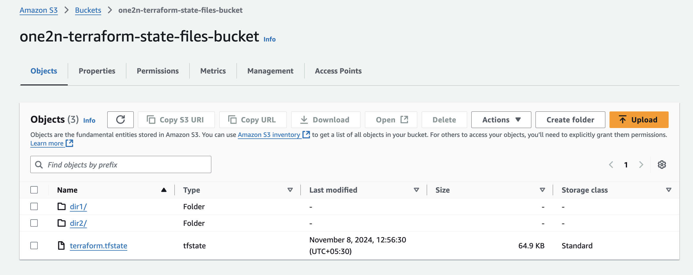

# S3 Bucket Content Listing Service

This project consists of a RESTful HTTP service that lists the contents of an AWS S3 bucket using API Gateway and Lambda, deployed with Terraform.

# Overview
The Lambda function, triggered via API Gateway, lists the contents of an S3 bucket path based on the HTTP request path parameters. It returns JSON with both directories and files present at the specified path. Also with cloudwatch log group configured.

### Step-by-Step Instructions
1. Create index.py file.

```
import json
import boto3
from botocore.exceptions import ClientError

s3_client = boto3.client('s3')

def list_s3_objects(bucket_name, prefix=''):
    try:
        response = s3_client.list_objects_v2(Bucket=bucket_name, Prefix=prefix, Delimiter='/')
        
        directories = []
        files = []

        if 'CommonPrefixes' in response:
            for common_prefix in response['CommonPrefixes']:
                dir_name = common_prefix['Prefix'].strip('/').split('/')[-1]
                directories.append(dir_name)

        if 'Contents' in response:
            for obj in response['Contents']:
                file_name = obj['Key'].split('/')[-1]
                if file_name:  # Only add non-empty names
                    files.append(file_name)
        
        return {
            'directories': directories,
            'files': files
        }
    except ClientError as e:
        print(f"Error listing objects in bucket {bucket_name}: {e}")
        return None

def lambda_handler(event, context):
    bucket_name = event['pathParameters']['bucket']
    path = event['pathParameters'].get('path', '')

    result = list_s3_objects(bucket_name, prefix=path)

    if result is None:
        return {
            'statusCode': 404,
            'body': json.dumps({'error': 'Bucket or path not found'})
        }
    
    return {
        'statusCode': 200,
        'body': json.dumps({
            'content': result['directories'] + result['files']
        })
    }

```

2. Package the code into a ZIP file to upload to AWS Lambda:
 ```
 $ zip index.zip index.py
 ```

## Terraform Setup for Infrastructure

### 1.  Setup AWS Terraform S3 and dynamoDB backend

Run the following commands to set up S3 as a backend for storing the state file, with DynamoDB for state locking and consistency:

```
cd backend
terraform init
terraform apply
```

This will create an S3 bucket to store the Terraform state files, a DynamoDB table for state locking, and a KMS key to encrypt the state file in S3, ensuring secure and consistent state management.


DynamoDB Lock Table

KMS


### 2. Setup AWS Lambda and Apigateway 

#### Add GET request route to api gateway
```
resource "aws_apigatewayv2_route" "one2N" {
  api_id    = aws_apigatewayv2_api.one2N.id
  route_key = "GET /list-bucket-content/{bucket}/{path+}"
  target = "integrations/${aws_apigatewayv2_integration.one2N.id}"
}
```

Run the following commands to setup Lambda and apigateway

```
cd terraform
terraform init
terraform apply
```

### AWS Lambda function


### API-GATEWAY
Endpoint


Routes GET /list-bucket-content/{bucket}/{path+}


Lambda Integration


# TEST RESULTS
### Obtained HTTPS endpoint of apigateway - https://szphjkqi23.execute-api.us-east-1.amazonaws.com/
## For Route 1
```
GET /list-bucket-content/one2n-terraform-state-files-bucket/
```
https://szphjkqi23.execute-api.us-east-1.amazonaws.com/list-bucket-content/one2n-terraform-state-files-bucket/


## For Route 2
```
GET /list-bucket-content/one2n-terraform-state-files-bucket/dir1/
```
https://szphjkqi23.execute-api.us-east-1.amazonaws.com/list-bucket-content/one2n-terraform-state-files-bucket/dir1/


## For Route 3
### Our code handles error for non existing path or for wrong bucket

```
GET /list-bucket-content/wrong-bucket/
```
https://szphjkqi23.execute-api.us-east-1.amazonaws.com/list-bucket-content/wrong-bucket/


---

<br>

# Final Note or Additional steps


* Custom Domain: Map a custom domain to the API Gateway endpoint for a branded URL.

* Authentication: Use API Gateway IAM roles, API keys, or Amazon Cognito to secure API access.
